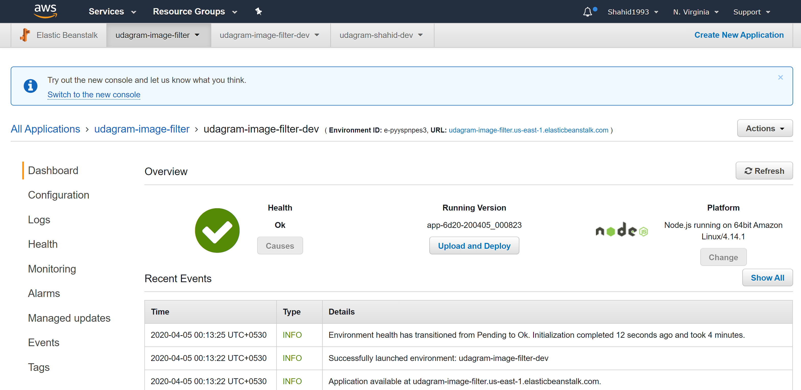

# Udagram Image Filtering Microservice

This is an image filtering microservice for Udagram. Udagram is a simple cloud application developed alongside the Udacity Cloud Engineering Nanodegree. It allows users to register and log into a web client and post photos to the feed.


### Tasks

- #### Setup Node Environment

- #### Create a new endpoint in the `server.ts` file

- #### Deploy your system in AWS Elastic Beanstalk


## Submission

## Local Deployment
```shell
npm i
npm run dev
```
## Elastic Beanstalk Deployment URL (EB_URL)
udagram-image-filter.us-east-1.elasticbeanstalk.com

## Elastic Beanstalk Deployment Screenshot



